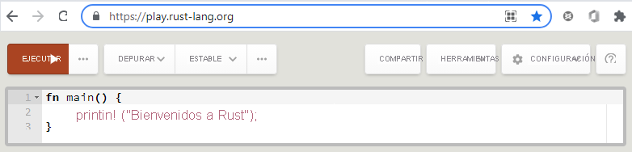
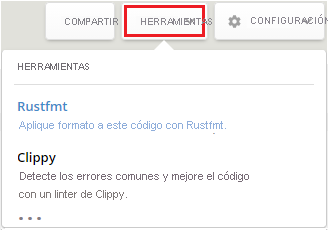
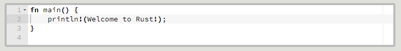
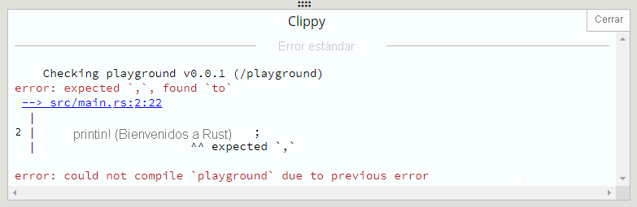
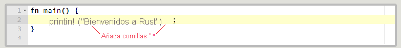
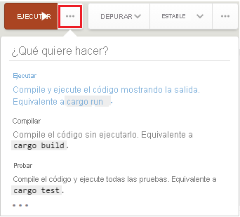
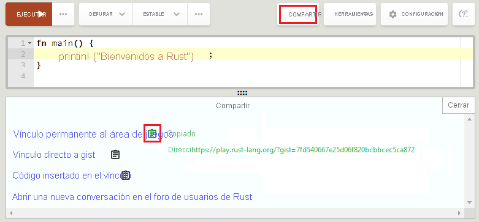
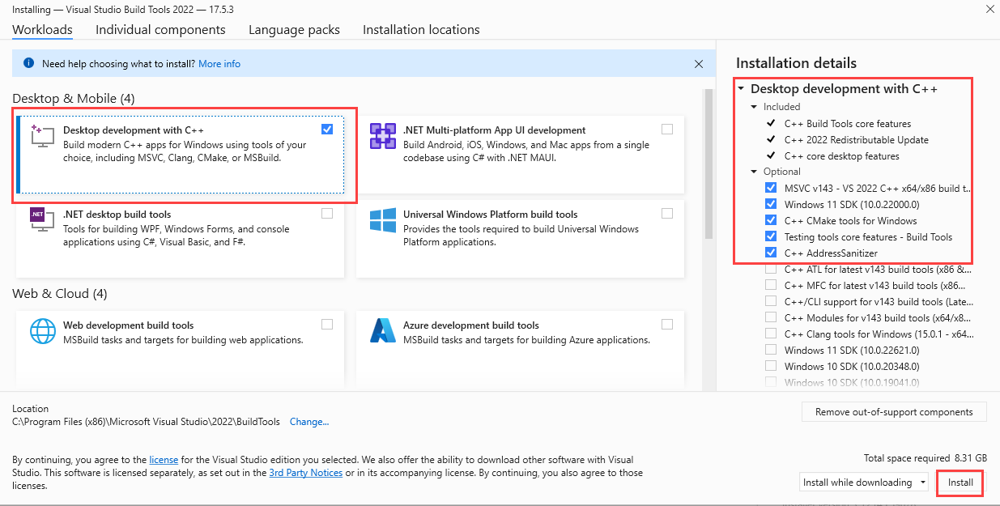
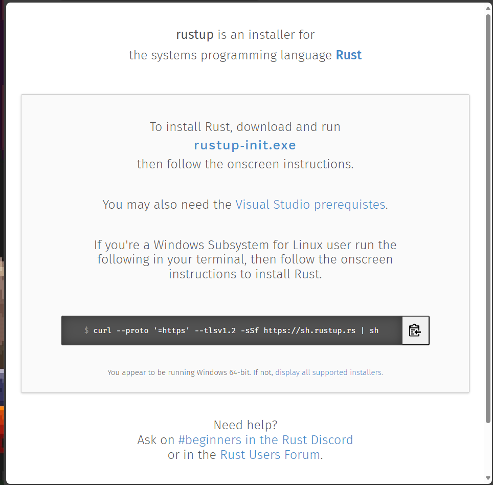

# Curso de Rust en Microsoft 🦀

**Primeros pasos con Rust**
¿Está interesado en aprender en un nuevo lenguaje de programación que está creciendo en uso y popularidad? ¡Empiece por aquí! Siente las bases del conocimiento que necesita para compilar programas rápidos y eficaces en Rust.

En esta ruta de aprendizaje, hará lo siguiente:

- Instalar las herramientas necesarios para escribir sus primeras líneas de código de Rust.
- Aprender los conceptos básicos de Rust.
- Aprender a administrar los errores.
- Administrar la memoria en Rust.
- Usar tipos y rasgos genéricos.
- Configurar módulos para paquetes y contenedores.
- Escribir y ejecutar pruebas automatizadas.
- Crear una herramienta de línea de comandos.

---

# Tabla de contenido

- [Curso de Rust en Microsoft 🦀](#curso-de-rust-en-microsoft-)
- [Tabla de contenido](#tabla-de-contenido)
- [Qué es Rust](#qué-es-rust)
  - [Introducción](#introducción)
    - [¿Cuál es la mejor manera de aprender Rust?](#cuál-es-la-mejor-manera-de-aprender-rust)
    - [Objetivos de aprendizaje](#objetivos-de-aprendizaje)
  - [¿Qué es Rust?](#qué-es-rust-1)
  - [Características únicas de Rust](#características-únicas-de-rust)
    - [Administración de código con el sistema de módulo de Rust](#administración-de-código-con-el-sistema-de-módulo-de-rust)
    - [Uso de crates y bibliotecas de Rust](#uso-de-crates-y-bibliotecas-de-rust)
    - [Creación y administración de proyectos con Cargo](#creación-y-administración-de-proyectos-con-cargo)
    - [Cuándo se debe usar Rust](#cuándo-se-debe-usar-rust)
    - [Comprobación de conocimientos](#comprobación-de-conocimientos)
  - [El área de juegos de Rust](#el-área-de-juegos-de-rust)
    - [Herramientas y características](#herramientas-y-características)
    - [Opciones de compilación](#opciones-de-compilación)
    - [Límites de protección](#límites-de-protección)
  - [Ejercicio](#ejercicio)
    - [Escritura de código en el área de juego](#escritura-de-código-en-el-área-de-juego)
    - [Compilación y ejecución de código en el sitio de prueba](#compilación-y-ejecución-de-código-en-el-sitio-de-prueba)
    - [Guardado y uso compartido de código en el sitio de prueba](#guardado-y-uso-compartido-de-código-en-el-sitio-de-prueba)
  - [Resumen](#resumen)
    - [Prueba de las recetas en la guía paso a paso de Rust](#prueba-de-las-recetas-en-la-guía-paso-a-paso-de-rust)
    - [Referencias](#referencias)
- [Configuración el entorno de desarrollo Rust](#configuración-el-entorno-de-desarrollo-rust)
  - [Introducción](#introducción-1)
    - [Objetivos de aprendizaje](#objetivos-de-aprendizaje-1)
  - [Instalar Visual Studio Code](#instalar-visual-studio-code)
    - [Herramientas para escribir código de Rust](#herramientas-para-escribir-código-de-rust)
    - [Comprobación de conocimientos](#comprobación-de-conocimientos-1)
  - [Instalación de las herramientas de compilación de Visual C++](#instalación-de-las-herramientas-de-compilación-de-visual-c)
  - [Instalación de Rust](#instalación-de-rust)
    - [Comprobación de la instalación de Rust](#comprobación-de-la-instalación-de-rust)
    - [Comprobación de conocimientos](#comprobación-de-conocimientos-2)
  - [Ejercicio: Hola mundo](#ejercicio-hola-mundo)
    - [Creación de un nuevo directorio para organizar el código](#creación-de-un-nuevo-directorio-para-organizar-el-código)
    - [Escritura del primer programa con Rust](#escritura-del-primer-programa-con-rust)
    - [Compilación y ejecución del programa](#compilación-y-ejecución-del-programa)
    - [Creación de un proyecto con Cargo](#creación-de-un-proyecto-con-cargo)
    - [Compilación y ejecución del programa con Cargo](#compilación-y-ejecución-del-programa-con-cargo)
  - [Resumen](#resumen-1)
- [Creación del primer programa de Rust](#creación-del-primer-programa-de-rust)
  - [Introducción](#introducción-2)
    - [Área de juegos de Rust](#área-de-juegos-de-rust)
    - [Objetivos de aprendizaje](#objetivos-de-aprendizaje-2)
  - [Descripción de la estructura básica de programas de Rust](#descripción-de-la-estructura-básica-de-programas-de-rust)
    - [Funciones en Rust.](#funciones-en-rust)
    - [Sangría del código](#sangría-del-código)
    - [Macro todo! macro](#macro-todo-macro)
    - [El println! macro](#el-println-macro)
    - [Sustitución de valores para argumentos {}](#sustitución-de-valores-para-argumentos-)
    - [Comprobación de conocimiento](#comprobación-de-conocimiento)

---

# Qué es Rust

Una introducción rápida a las características del lenguaje Rust y comparación de Rust con otros lenguajes de programación.

## Introducción

con el lenguaje de programación de Rust, puede compilador software de sistemas confiable y eficaz. Los desarrolladores usan Rust para software de red como servidores web, servidores de correo y exploradores web. Rust también está presente en compiladores e intérpretes, contenedores de virtualización y software, bases de datos, sistemas operativos y criptografía. También puede usar Rust para compilar juego, programas de línea de comandos, programas de ensamblado web y aplicaciones diseñadas para dispositivos incrustados.

Rust es una alternativa segura a los lenguajes de software de sistemas existentes como C y C++. Al igual que C y C++, Rust no tiene un recolector de elementos no utilizados o del entorno de ejecución de gran tamaño, lo que lo diferencia de casi todos los demás lenguajes modernos. Sin embargo, a diferencia de C y C++, Rust garantiza la seguridad de la memoria; Rust evita muchos de los errores relacionados con el uso incorrecto de la memoria que podría encontrar en C y C++.

Rust logra un equilibrio único entre expresiones de rendimiento, seguridad e implementación. Sea cual sea su experiencia en programación, descubrirá que Rust tiene algo que ofrecerle.

### ¿Cuál es la mejor manera de aprender Rust?

Rust requiere algunos conocimientos teóricos para poder escribir código de Rust por su cuenta de forma productiva. Siga este curso u otros recursos de aprendizaje de Rust antes de comenzar su desarrollo. Una vez que cuente con unas nociones básicas del lenguaje, practique la escritura de código lo máximo posible. Escriba al realizar los ejercicios de este módulo y de todos los demás de esta ruta de aprendizaje.

Comenzaremos aprendiendo los pequeños conceptos fundamentales del lenguaje. A continuación, con basaremos en los ejercicios prácticos y la exploración. Creará unos cuantos proyectos a lo largo del proceso y, al final de la lección, tendrá una idea sódica del lenguaje.

### Objetivos de aprendizaje

En este módulo, aprenderá lo siguiente:

- Algunas de las características únicas de Rust.
- Por qué los desarrolladores eligen Rust en lugar de otros lenguajes de programación.
- Componentes y herramientas básicas para crear, compilar y ejecutar programas de Rust.
- Uso del área de juegos de Rust.

---

## ¿Qué es Rust?

Rust es un lenguaje de programación de sistemas de código abierto que puede usar para desarrollar software seguro y eficaz. Con Rust, puede administrar la memoria y controlar otros detalles de bajo nivel. Pero también puede aprovechar los conceptos de alto nivel, como la iteración y las interfaces. Estas características distinguen a Rust de los lenguajes de bajo nivel, como C y C++.

Rust también ofrece las siguientes ventajas que lo hacen ideal para una amplia gama de aplicaciones.

- **Seguridad de tipos:** el compilador garantiza que no se aplicará ninguna operación a una variable de un tipo incorrecto.
- **Seguridad de memoria:** los punteros de Rust (conocidos como *referencia*) siempre hacen referencia a la memoria válida.
- **Sin carrera de datos:** el comprobador de préstamos de Rust garantiza la seguridad para subprocesos asegurándose de que varias partes de un programa no puedan mutar el mismo valor al mismo tiempo.
- **Abstracciones de costo cero:** Rust permite el uso de conceptos generales, como la iteración, las interfaces y la programación funcional, con un costo de rendimiento mínimo o nulo. Las abstracciones funcionan tan bien como si hubiera escrito el código subyacente a mano.
- **Tiempo de ejecución mínimo:** Rust tiene un tiempo de ejecución mínimo y opcional. Con el fin de administrar la memoria de forma eficaz, el lenguaje tampoco tiene ningún recolector de elementos no utilizados. De este modo, Rust se parece más a lenguajes como C y C++.
- **Destinos sin sistema operativo:** Rust puede tener como destino la programación insertada y sin sistema operativo, lo que lo hace adecuado para escribir un kernel de sistema operativo o controladores de dispositivo.

Según la [encuesta de desarrolladores de Stack Overflow de 2022](https://survey.stackoverflow.co/2022/#overview?azure-portal=true), Rust ha sido el lenguaje más apreciado durante varios años seguidos. Los desarrolladores disfrutarán de la programación con Rust. Muchos tipos de organizaciones, desde las startup hasta las grandes empresas, usan Rust en sus casos de uso exclusivos. Desde la creación de herramientas, hasta la escritura de aplicaciones web, el trabajo en servidores o la creación de sistemas insertados, las posibilidades son infinitas.

---

## Características únicas de Rust

Para averiguar si un lenguaje de programación es adecuado para un proyecto, debe conocer las características y las limitaciones. A continuación, puede comparar los lenguajes posibles y elegir el que mejor funcione.

En esta unidad, revisaremos algunas de las características y limitaciones de Rust:

- El sistema de módulo de Rust: módulo, crates y rutas.
- Bibliotecas estándar de Rust y crates de terceros.
- La herramienta Cargo de Rust y el administrador de dependencias
- Cuándo se debe usar Rust.

### Administración de código con el sistema de módulo de Rust

Rust ofrece un colección de características que le ayudarán a administrar y organizar el código. Estas características se conocen como **sistema de módulos de Rust**. El sistema se compone de *crates, módulos y rutas*, as+i como herramientas para trabajar con esos elementos.

- **Crates**: Un crate de Rust es una unidad de compilación. Es el fragmento de código más pequeño que puede ejecutar el compilador de Rust. El código de un crate se compila en conjunto para crear un archivo ejecutable binario o una biblioteca. En Rust, solo los crates se compilan como unidades reutilizables. Un crate contiene una jerarquía de módulos de Rust con un módulo implícito de nivel superior sin nombre.
- **Módulos:** Los módulos de Rust ayudan a organizar el programa, ya que permiten administrar el ámbito de los elementos de código individuales dentro de un crate. Los elementos de código relacionado o los elementos que se usan juntos se pueden agrupar en el mismo módulo. Las definiciones de código recursivas pueden abarcar otros módulos.
- **Rutas:** En Rust, puede usar rutas para dar nombre a los elementos del código. Por ejemplo, una ruta puede ser una definición de datos, como un vector, una función de código o incluso un módulo. La característica de módulo también le ayuda a controlar la privacidad de las rutas. Puede especificar las partes del código a las que se puede acceder públicamente frente a las partes privadas. Esta características le permite ocultar los detalles de implementación.

### Uso de crates y bibliotecas de Rust

La biblioteca estándar de Rust, `std`, contiene código reutilizable para las definiciones y operaciones fundamentales de los programas de Rust. Esta biblioteca tiene definiciones para tipos de datos principales como, por ejemplo, `String` y `Vec<T>`, operaciones para primitivas de Rust, código para funciones de macro usadas con frecuencia, compatibilidad con acciones de entrada y salida, y muchas otras áreas de funcionalidad.

Hay decenas de miles de bibliotecas y crates de terceros disponibles para su uso en los programas Rust; para acceder a la mayoría de ellas se puede usar el repositorio de crates terceros de Rust, [crates.io](https://crates.io). Más adelante veremos cómo acceder a estos create desde nuestro proyecto, pero por ahora estas son algunas de las crates que se usan en los ejercicios de programación:

- [std](https://doc.rust-lang.org/std): Biblioteca estándar de Rust. En los ejercicios de Rust, verá que aparecen los siguientes módulos:
  - std::collections: definiciones de tipos de colección, como `HashMap`.
  - std::env: Funciones para trabajar con el entorno.
  - std::fmt: Funcionalidad para controlar el formato de salida.
  - std::fs: Funciones para trabajar con el sistema de archivos.
  - std::io: Definiciones y funcionalidad para trabajar con entradas y salidas.
  - std::path: Definiciones y funciones que permiten trabajar con datos de ruta de acceso del sistema de archivo.
- [structopt]((https://crates.io/crates/structopt)): crate de terceros para analizar argumentos de línea de comandos fácilmente.
- [chrono](https://crates.io/crates/chrono): crate de terceros para controlar los datos de fecha y hora.
- [regex](https://crates.io/crates/regex): crate de terceros para trabajar con expresiones regulares.
- [serde](https://crates.io/crates/serde): crate de terceros con operaciones de serialización y deserialización de estructuras de datos de Rust.

De manera predeterminada, la biblioteca `std` está disponible para todos los crates de Rust. Para acceder al código reutilizable en un crate o biblioteca, implementamos la palabra clave `use`. Con la palabra clave `use`, el código del crate o biblioteca se "incluye en el ámbito" para que pueda acceder a las definiciones y funciones en el programa. Se accede a la biblioteca estándar en instrucciones `use` con la ruta `std`, como en `use std::fmt`. Se accede a otros crates o bibliotecas con su nombre, como `use regex::Regex`.

### Creación y administración de proyectos con Cargo

Aunque se puede usar el compilador de Rust (`rustc`) directamente para crear crates, en la mayoría de los proyectos se usa la herramienta de compilación de Rust y un administrador de dependencias llamando **Cargo**.

Cargo hace gran cantidad de cosas, entre las que se incluyen las siguientes:
 
- Crear nuevas plantillas de proyecto con el comando `cargo new`.
- Compilar un proyecto con el comando `cargo build`.
- Compilar y ejecutar un proyecto con el comando `cargo run`.
- Probar un proyecto con el comando `cargo test`.
- Comprobar los tipos de proyectos con el comando `cargo check`.
- Compilar la documentación de un proyecto con el comando `cargo doc`.
- Publique una biblioteca para `crates.io` con el comando `cargo publish`.
- Para agregar crates dependientes a un proyecto, agregue el nombre del crate al archivo Cargo.toml.

### Cuándo se debe usar Rust

El lenguaje Rust tiene numerosos puntos a favor que se deben tener en cuenta al elegir el mejor lenguaje para un proyecto:

- Rust permite controlar el rendimiento y el consumo de recursos de los programas y bibliotecas escritos en el lenguaje en el mismo nivel que C y C++, al tiempo que mantiene la memoria protegida. Este nivel de control elimina todas las clases de errores comunes.
- Rust tiene características de abstracción muy completas que permiten a los desarrolladores codificar muchos de los aspectos invariables de sus programas en código, que luego el compilador se encarga de comprobar en lugar de depender de convenciones o documentaciones. Esta característica suele dar lugar a la impresión de que "si se compila, funciona".
- Rust tiene herramientas integradas para compilar, probar, documentar y compartir código, así como un ecosistema completo de herramientas y bibliotecas de terceros. Gracias a estas herramientas, algunas tareas que son difíciles en algunos lenguajes, como crear dependencias, resultan fáciles de llevar a cabo y productivas en Rust.

### Comprobación de conocimientos

Responda a las preguntas siguientes para ver lo que ha aprendido. Elija una respuesta para cada pregunta y, después, seleccione **Comprobar las respuestas**.

1. **¿Cuál es una ventaja atractiva de trabajar con Rust?**
  - [x] Rust es un lenguaje con seguridad de tipos, con seguridad de memoria y sin carrera de datos.
  - [ ] Rust está optimizado para el desarrollo sin sistema operativo, como los sistemas operativos.
  - [ ] Rust tiene un recolector de elementos no utilizados sólido y permite administrar la memoria de forma eficaz.

2. **¿Cómo se ejecuta el código de Rust?**

  - [ ] Los programas de Rust no se compilan en un script, sino en un archivo ejecutable.
  - [ ] El código de Rust debe estar incluido en un archivo de código fuente de C++.
  - [x] A través de la compilación seguida de la ejecución directa.

3. **¿Cuál sería un ejemplo de algo que no se puede hacer con Cargo?**
  - [ ] Compilar un proyecto de Rust existente.
  - [x] Actualizar la versión del compilador de Rust instalada.
  - [ ] Publicar una biblioteca en Crates.io.

---

## El área de juegos de Rust

En ocasiones, solo quiere probar un poco del código de Rust o comprobar la sintaxis de una definición en una biblioteca de Rust. También podría estar buscando una manera de compartir rápidamente código con otros. El lenguaje Rust permite estas tareas en el área de juegos de Rust.

El área de juegos es un IDE para el desarrollo en Rust, que está disponible en Internet en `https://play.rust-lang.org/`. Cualquier puede accede al área dde juegos. Puede escribir el código y, luego, compilado y ejecutarlo en el mismo entorno. En la captura de pantalla siguiente se muestra el entorno del área de juegos. En el extremo derecho de la barra de herramientas, el menú **CONFIG** tiene opciones para establecer las preferencias del entorno.

En el área de juegos, puede acceder a los métodos y funciones de la biblioteca estándar de Rust, `std`. Los 100 crates principales más descargados de la biblioteca `crates.io` también están disponibles junto con sus dependencias.

### Herramientas y características

El sitio de prueba de Rust tiene varias herramientas y características de desarrollo integradas:

- Código de formato: la herramienta **Rustfmt** da formato al código para seguir los estilos oficiales de Rust. La herramienta ajusta el código y aplica la sangría y el espaciado recomendados entre los elementos y operadores.
- Probar código: la herramienta **Clippy** comprueba si hay errores en el código. La herramienta ejecuta pruebas de *lint* en el código para buscar errores y áreas de mejora.
- Guardar código: a medida que se trabaja en el sitio de prueba de Rust, el código se guarda automáticamente en el almacenamiento local del explorador. Esta característica facilita la recuperación del trabajo más reciente, en especial si cierra la ventana del explorador.
- Compartir código: la característica **Compartir** crea un gist de GitHub que se puede compartir para el código del sitio de prueba. Puede guardar esta dirección URL para acceder al código más adelante. La dirección URL carga el gist del código específico en el área de juegos.

> **Nota:**
> El almacenamiento local de un explorador es un recurso singleton. Si tiene más de una ventana del explorador abierta en el área de juegos de Rust y está trabajando con código diferente en cada ventana, solo el código guardado más recientemente entre todas las ventanas se conservará en el almacenamiento local.

### Opciones de compilación

Hay varias opciones para compilar y ejecutar código en el sitio de prueba de Rust:

- **Run** (Ejecutar): Compile y ejecute el código y vea la salida. La opción **Run** es lo mismo que usar el comando `cargo run`.
- **Build** (Compilar): Compile el código, pero no lo ejecute. La opción **Build** es lo mismo que usar el comando `cargo build`.
- **Test** (Probar): Compile el código y ejecute todas las pruebas en el código. La opción **Test** es lo mismo que usar el comando `cargo test`.

### Límites de protección

Hay algunas limitaciones en el área de juegos para evitar que el sitio se utilice de forma malintencionada. Las restricciones ayudan a garantizar que el sitio sigue estando disponible para todos los usuarios.

- **Red:** Al compilar o ejecutar código en el área juegos, no hay disponible una conexión de red.
- **Memoria:** El área de juegos limita la memoria disponible para compilar código y ejecutar un programa compilado.
- **Tiempo de ejecución:** El área de juegos establece una cantidad máxima de tiempo para compilar código y ejecutar un programa compilado.
- **Disco:** La cantidad de espacio disponible en disco para compilar código y ejecutar un programa compilado es limitada.

Puede obtener más información sobre las características del área de juegos de Rust en el [sitio web de Rust](https://play.rust-lang.org/help).

1. ¿Qué herramienta del área de juegos de Rust se puede usar para encontrar errores en el código?

- [ ] rustfmt
- [x] Clippy
- [ ] Depuración

2. ¿Cuándo no está disponible una conexión de red en el sitio de pruebas de Rust?

- [ ] Cuando se edita código
- [ ] Cuando se ejecuta un programa
- [x] Al compilar código o ejecutar un programa.

## Ejercicio

El área de juegos de Rust es práctica para probar pequeños programas, probar nuevos crates y bibliotecas, y compartir código con otros usuarios. En este ejercicio, crearemos un pequeño programa en el área de juegos para familiarizamos con el entorno.

### Escritura de código en el área de juego

Para empezar, vamos a escribir código para un programa básico.

  1. Conéctese al [Área de juegos de Rust](https://play.rust-lang.org/).
  2. Escriba el código siguiente en el editor del área de juegos:
  ~~~rust
   fn main(){println!(Welcome to Rust!);}
  ~~~
  3. Seleccione **Herramientas**>**Rustfmt** para dar formato al código:
  
  La herramienta ajusta el código para seguir los estilos oficiales de Rust:
  
  4. Seleccione **Tools** (Herramientas)>**Clippy** para comprobar si hay errores en el código. Los resultados se muestran en el editor:
  
  5. Para corregir el código de ejemplo, agregue comillas alrededor del texto "Welcome to Rust!":
  

### Compilación y ejecución de código en el sitio de prueba

Ahora se compilará el código y se ejecutará el programa.

  1. Para elegir cómo compilar y ejecutar el código en el sitio de prueba, abra el menú desplegable **Run** (Ejecución) en la parte superior de la interfaz de usuario:
  
  2. Seleccione **Run** para compilar y ejecutar el programa de ejemplo. La salida del programa se muestra en el editor:
  

### Guardado y uso compartido de código en el sitio de prueba

A medida que trabaje en el sitio de prueba, el código se guardará automáticamente en el almacenamiento del explorador. Si cierra la ventana del explorador, puede perder el código que ha escrito. Para que el código esté siempre disponible, puede crear un dirección URL compartible.

  1. Seleccione la característica **Share** (Compartir) en la barra de herramientas para crear un gist de GitHub para el código en el sitio de prueba:
  
  2. Seleccione el icono de papel junto al texto **Permalink to the playground** (Vinculo permanente al área de juegos) para obtener un gist que se pueda compartir para el código.

Ahora se puede guardar la dirección URL para acceder al código más tarde, o bien compartir la URL para que otros usuarios vean el código.

## Resumen

En este módulo, ha aprendido sobre los tipos de aplicaciones que puede compilar mediante el lenguaje de programación Rust. Por qué Rust es útil para los tipos de desarrollo de bajo nivel y alto nivel.

Ha revisado los comandos de Rust para trabajar con el código. Que el comando `rustc` se usa para escribir y compilar programas de Rust.

Ha descubierto la característica Cargo de Rust y ha aprendido sobre el sistema de módulo para la organización del código. Para crear, compilar y ejecutar un proyecto, se usa Cargo.

Hemos analizado el entorno del área de juego de Rust y hemos visto cómo escribir, compilar, probar y ejecutar código.

### Prueba de las recetas en la guía paso a paso de Rust

La Rust Cookbook contiene *recetas* para el código que sigue las prácticas recomendadas para tareas de programación comunes. Al seguir las recetas, puede obtener información sobre cómo trabajar con los crates usados con frecuencia en Rust. Las recetas abarcan una amplia variedad de temas, incluido el procesamiento de texto y números, el trabajo con bases de datos, la aplicación de algoritmo comunes y la depuración de programas. Puede leer Rust Cookbook en el [sitio web de Rust](https://rust-lang-nursery.github.io/rust-cookbook/).

### Referencias

- [Biblioteca estándar std de Rust](https://doc.rust-lang.org/std/)
- [Repositorio de bibliotecas crates.io de Rust](https://crates.io/)
- [Recetas de Rust Cookbook](https://rust-lang-nursery.github.io/rust-cookbook/)
- [Ayuda del área de juegos de Rust](https://play.rust-lang.org/help)
- [Encuesta para desarrolladores de Stack Overflow de 2022](https://survey.stackoverflow.co/2022/#overview?azure-portal=true)

---

# Configuración el entorno de desarrollo Rust

Obtenga información sobre cómo configurar el entorno de desarrollo de Rust, escribir un programa y usar el sistema de compilación Cargo.

## Introducción

En esta unidad, se describirán los pasos necesarios para instalar y configurar el entorno de desarrollo para que pueda empezar a programar en Rust.

Para programar en Rust, instalará el editor de Visual Studio Code, las herramientas de compilación de Microsoft C++ para Visual Studio Code y los archivos del lenguaje Rust.

Una vez configurado el entorno, probaremos un programa básica "Hola mundo" para confirmar que está listo para empezar.

### Objetivos de aprendizaje

En este módulo, ha aprendido a hacer lo siguiente:

  - Configuración del entorno de desarrollo para usar Rust
  - Compile y ejecute un programa básico "Hola mundo"
  - Usar Cargo, la herramienta de compilación de Rust y el administrador de dependencias.

## Instalar Visual Studio Code

Como aspirante a desarrollador de Rust, deberá escribir código fuente de Rust en archivos de texto.

Un archivo de código fuente de Rust es un archivo de texto con una extensión .rs en el que se escribe todo el código de Rust. Después de guardar el código en el archivo de texto, utilice el compilador de Rust (`rustc`) o Cargo para compilar el código en un programa.

### Herramientas para escribir código de Rust

Normalmente, la sintaxis de Rust se escribe en un archivo de texto y se guarda en la unidad de disco duro local. Se puede escribir código mediante un editor de archivos de texto simple, como el Bloc de notas de Windows. El Bloc de notas edita texto ASCII, un formato de archivo de texto estándar simple.

> **Sugerencia:**
> Evite el uso de editores de texto que incluyan opciones de formato, como negrita, subrayado o cursiva, o de cualquier otro programa que tenga características de procesamiento de texto. Por ejemplo, no escriba código en Microsoft Word ni en TextEdit en macOS. Estos programas tienen instrucciones de formato adicionales que el compilador de Rust no entenderá.

Aunque puede usar un editor de texto, normalmente se suele usar una herramienta que se adapte mejor a los desafíos asociados a la escritura de código. Hay gran cantidad de opciones, pero muchos desarrolladores confían en Visual Studio Code para este propósito. Visual Studio Code es gratis y está disponible en Windows, macOS y Linux. Tiene muchas características que permiten navegar fácilmente por el código, independientemente del lenguaje de programación con el que quiera trabajar.

Elija uno de los siguientes procedimientos de instalación, en función del sistema operativo.

### Comprobación de conocimientos

Responda a las preguntas siguientes para ver lo que ha aprendido. Elija una respuesta para cada pregunta y, después, seleccione Comprobar respuestas.

1. ¿Qué dos maneras se pueden usar para compilar un programa de Rust? 

- [ ] compile y rustc
- [ ] build y rustc
- [x] Cargo y rustc

## Instalación de las herramientas de compilación de Visual C++

Rust requiere las herramientas de compilación de Microsoft C++ para Visual Studio 2013 o versiones posteriores. Estas herramientas de compilación deben instalarse antes de instalar Rust.

Si no tiene instaladas las herramientas de compilación, siga estos pasos:

  1. Vaya a la [página de descarga de Microsoft Visual Studio](https://visualstudio.microsoft.com/visual-cpp-build-tools/).
  2. Seleccione **Descargar Build Tools**.
  3. Una vez finalizada la descarga, ejecute el archivo del instalador. Se abre la ventana del instalador de Visual Studio.
  4. En el cuadro de diálogo emergente, seleccione Sí. En el siguiente cuadro de diálogo emergente, seleccione **Continuar**.
  5. En la ventana del instalador, en **Móviles y de escritorio**, active la casilla de la opción **Desarrollo de escritorio con C++**.
  6. En el panel **Detalles de la instalación**, asegúrese de que estén seleccionadas las siguientes opciones:
  > **Nota:**
  > Asegúrese de seleccionar el SDK correcto para el sistema operativo.
  
  7. Seleccione **Instalar**

Una vez completa la instalación, puede continuar con la instalación de Rust.

## Instalación de Rust

La manera recomendada de instalar Rust es usar `rustup`, el instalador de la cadena de herramientas de Rust. Vaya al sitio web [rustup.rs](https://rustup.rs/) para encontrar las instrucciones adecuadas correspondientes a su sistema operativo.

En Linux o macOS, copie el comando curl seleccionando el icono del portapapeles. Después, abra el terminal del equipo o el símbolo del sistema para pegar el comando y siga las instrucciones que aparecen en pantalla. En Windows, siga las instrucciones del instalador.

> **Importante:**
> Rust requiere las herramientas de compilación de Microsoft C++ para Visual Studio 2013 o versiones posteriores. Las herramientas de compilación deben instalarse antes de instalar Rust. Si tiene que instalar las herramientas de compilación, vea los pasos de la unidad anterior.

Rust tiene un proceso de lanzamiento rápido de seis semanas y admite un gran número de plataformas, por lo que hay muchas compilaciones de Rust disponibles en cualquier momento. Si ha instalado `rustup` en el pasado, puede actualizar a la versión estable más reciente de Rust ejecutando el comando `rustup update`.

### Comprobación de la instalación de Rust

Una vez completada la instalación de Rust, debe tener disponibles los comandos `rustc` y `cargo`.

> **Nota:**
> Los comandos siguientes funcionan en todas las plataformas.

Ejecute el siguiente comando en el terminal o símbolo del sistema:

~~~bash
rustc --version
~~~

Debería ver una salida como la de este ejemplo:

~~~bash
rustc 1.76.0 (07dca489a 2024-02-04)
~~~

Luego, ejecute el siguiente comando:

~~~bash
cargo --version
~~~

Debería ver una salida similar a esta:

~~~bash
cargo 1.50.0 (f04e7fab7 2021-02-04)
~~~

Ambas líneas de salida contienen la siguiente información sobre las versiones estables más recientes de Rust y Cargo que están disponibles:

  - Número de versión
  - Hash de confirmación
  - Fecha de confirmación

Esta información aparece en el formato siguiente:

`<executable-name> <three-part-release-number> (<9-character-hash-code> <4-digit-year>-<2-digit-month>-<2-digit-day>)`

Si ve este tipo de salida, significa que ambas instalaciones se han realizado correctamente. Si no ve esta información, compruebe la variable de entorno `PATH`. Asegúrese de que incluye una carpeta que contiene los archivos ejecutables `rustc.exe` y `cargo.exe`.

### Comprobación de conocimientos

Responda a las preguntas siguientes para ver lo que ha aprendido. Elija una respuesta para cada pregunta y, después, seleccione Comprobar respuestas.

1. ¿Cuál es el comando recomendado que se debe usar para instalar Rust? 

- [ ] rinstall
- [x] rustup
- [ ] rupdate

2. ¿Con qué frecuencia se actualizan las bibliotecas de Rust? 

- [ ] Cada seis meses
- [ ] Cada tres meses
- [x] Cada seis semanas

## Ejercicio: Hola mundo

Con Rust instalado, está listo para empezar a crear código. Vamos a escribir un programa que imprima "Hola mundo" en la consola.

### Creación de un nuevo directorio para organizar el código
 
Empiece por crear un directorio para almacenar todo el código en esta ruta de aprendizaje (`rust-learning-path`) y luego cree un nuevo subdirectorio para mantener el código fuente de este ejercicio.

Para Linux y macOS, ejecute los siguientes comandos:

~~~bash
mkdir ~/rust-learning-path
cd ~/rust-learning-path
mkdir hello-world
cd hello-world
~~~

Para PowerShell en Windows, ejecute los siguientes comandos:

~~~powershell
mkdir "%USERPROFILE%\rust-learning-path"
cd /d "%USERPROFILE%\rust-learning-path"
mkdir hello-world
cd hello-world
~~~

### Escritura del primer programa con Rust

A continuación, cree un nuevo archivo denominado main.rs y use el editor para escribir el código siguiente:

~~~rust
fn main() {
	println!("Hello, world!");
}
~~~

### Compilación y ejecución del programa

El código fuente está listo. Ahora es el momento de compilar el programa en un archivo ejecutable. Vuelva a la ventana de terminal y escriba los siguientes comandos para compilar y ejecutar el archivo.

En Windows, ejecute los siguientes comandos:

~~~powershell
rustc main.rs
.\main.exe
~~~

Si está en Linux o macOS, ejecute los siguientes comandos:

~~~bash
rustc main.rs
./main
~~~

Debería ver la siguiente salida:

~~~bash
Hello, world!
~~~

### Creación de un proyecto con Cargo

Ahora se usará Cargo para escribir y ejecutar el mismo programa.

> **Nota:**
> Los comandos de las secciones siguientes funcionan en todas las plataformas

Para empezar, se use Cargo para crear un proyecto.

Asegúrese de que el terminal está en el directorio `rust-learning-path` y ejecute el siguiente comando:

~~~bash
cargo new hello-cargo
~~~

Este comando generado un nuevo directorio denominado *hello-cargo* con un subdirectorio *src* y agrega dos archivos:

> hello-cargo/
>      Cargo.toml
>      src/
>          main.rs

  - El archivo *Cargo.toml* es el archivo de manifiesto de Rust. Es donde se conservan los metadatos para el proyecto, así como las dependencias.
  - El archivo *main.rs* en el subdirectorio *src* es donde escribirá el código de la aplicación.

Observe que el comando `cargo new` generó un proyecto "Hola mundo" reutilizable automáticamente.

### Compilación y ejecución del programa con Cargo

Para ejecutar el programa reutilizable, pasaremos al nuevo directorio hello-cargo y, a continuación, usaremos el comando `cargo run`.

Ejecute los siguientes comandos en el terminal:

~~~bash
cd hello-cargo
cargo run
~~~

Debería aparecer la salida siguiente en el terminal:

~~~bash
Compiling hello-cargo v0.1.0 (/tmp/.OFUp/hello-cargo)
    Finished dev [unoptimized + debuginfo] target(s) in 1.59s
      Running `target/debug/hello-cargo`

Hello, world!
~~~

Cargo ha compilado y ejecutado el archivo ejecutable.

Enhorabuena, ha escrito el primer programa de Rust y ha aprendido a inicializar el primer proyecto de Rust con Cargo.

## Resumen

En este módulo, ha instalado Rust y las herramientas de Visual Studio Code que necesita para escribir y ejecutar programas de Rust. Una vez configurado el entorno, ha creado un programa básico "Hola mundo" y lo ha modificado para que use Cargo para iniciar una nueva plantilla de proyecto.

En el siguiente módulo de esta ruta de aprendizaje, recorrerá algunos conceptos de programación comunes en Rust, como funciones, tipos de datos y flujo de control.

# Creación del primer programa de Rust

Obtenga información sobre los conceptos de Rust, como variables, tipos de datos y funciones.

**Objetivos de aprendizaje**

En este módulo, aprenderá a:

  - Explorar los conceptos básicos del lenguaje Rust, incluidas las funciones, los tipos de datos y las variables
  - Comprender los tipos de Rust básicos para texto, números, valores booleanos y datos compuestos
  - Crear, compilar y ejecutar un programa básico de Rust
  - Descubrir cómo imprimir la salida del programa

## Introducción

En este módulo, obtendrá información sobre conceptos comunes en los lenguajes de programación y descubrirá cómo se implementan en Rust. Los conceptos no son exclusivos de Rust, pero proporcionan una base para todos los programas con Rust. Al obtener información sobre estos conceptos, podrás entender cómo admitir el desarrollo en cualquier lenguaje de programación.

### Área de juegos de Rust

El [área de juegos de Rust](https://play.rust-lang.org/) es una interfaz de explorador para el compilador de Rust. Puede usar el área de juegos para experimentar con la escritura de código de Rust antes de instalar el lenguaje localmente o cuando no tenga el compilador disponible. A lo largo de este curso, se proporcionarán vínculos del área de juegos al código y a los ejercicios de ejemplo. Puede interactuar con el código, aunque no tenga la cadena de herramientas de Rust disponible en ese momento.

Todo el código que se ejecuta en el Área de juegos de Rust también se puede compilar y ejecutar en el entorno de desarrollo local. No dude en interactuar con el compilador de Rust del equipo. Puede obtener más información sobre el área de juegos de Rust en el módulo [¿Qué es Rust?](#¿qué-es-rust).

### Objetivos de aprendizaje

En este módulo, aprenderá a:
  - Explore los conceptos básicos del lenguaje Rust, incluidas las funcionas, los tipos de datos y las variables.
  - Comprenda los tipos de Rust básicos para texto, números, valores booleanos y datos compuestos.
  - Cree, compile y ejecute un programa básico de Rust.
  - Descubra cómo imprimir la salida del programa.

## Descripción de la estructura básica de programas de Rust

En esta unidad, se  revisa cómo se estructura un programa simple de Rust.

### Funciones en Rust.

Una función es un bloque de código que realiza una tarea específica. Separamos el código de nuestro programa en bloques basados en tareas. Esta separación hace que el código sea más fácil de entender y mantener. Después de definir una función para una tarea, podemos llamar a la función cuando sea necesario realizar esa tarea.

Cada programa de Rust debe tener una función llamada `main`, El código de la función `main` siempre es el primer código que se ejecuta en un programa con Rust. Podemos llamar a otras funciones desde la función `main` o desde otras funciones.

~~~rust
fn main() {
  println!("Hello, world!");
}
~~~

Para declarar una función en Rust, usamos la palabra clave `fn`. Después del nombre de la función, se le indica al compilador cuántos parámetros o *argumentos* espera la función como entrada. Los argumentos se enumeran entre paréntesis `()`. El *cuerpo de la función* es el código que realiza la tarea de una función y se define entre llaves `{}`. Un procedimiento recomendado consiste en aplicar formato al código para que la llave de apertura del cuerpo de la función aparezca justo después de la lista de argumentos entre paréntesis.

### Sangría del código

En el cuerpo de la función, la mayoría de las instrucciones de código terminan con un punto y coma `;`. Rust procesa estas instrucciones una tras otra, por orden. Cuando una instrucción de código no termina con un punto y coma, Rust sabe que la línea de código siguiente debe ejecutarse antes de que se pueda completar la instrucción inicial.

Para ayudar a ver las relaciones de ejecución en el código, usamos la sangría. Este formato muestra cómo se organiza el código y revela el flujo de pasos necesarios para completar la tarea de la función. A una instrucción de código inicial se le aplica una sangría de cuatro espacios desde el margen izquierdo. Cuando el código no termina con un punto y coma, a la siguiente línea de código que se va a ejecutar se le aplica una sangría de cuatro espacios más.

Veamos un ejemplo:

~~~rs
fn main() { // The function declaration is not indented

    // First step in function body
        // Substep: execute before First step can be complete

    // Second step in function body
        // Substep A: execute before Second step can be complete
        // Substep B: execute before Second step can be complete
            // Sub-substep 1: execute before Substep B can be complete

    // Third step in function body, and so on...
}
~~~

### Macro todo! macro

Cuando trabaje en los ejercicios de los módulos de Rust, observará que en el código de ejemplo se suele usar la macro `todo!`. En Rust, una macro es como una función y toma un numero variable de argumentos de entrada. La macro `todo!` se usa para identificar código sin terminar en el programa comportamiento que no está completo.

Este es un ejemplo de cómo se usa la macro `todo!` en los ejercicios:

~~~rs
fn main() {
  // Display the message "Hello, world!"
  todo!("Display the message by using the println!() macro");
}
~~~

Al compilar código en el que se usa la macro `todo!`, el compilador puede devolver un mensaje de alarma en el que espera encontrar la funcionalidad completada:

~~~cmd
Compiling playground v0.0.1 (/playground)
    Finished dev [unoptimized + debuginfo] target(s) in 1.50s
     Running `target/debug/playground`
thread 'main' panicked at 'not yet implemented: Display the message by using the println!() macro', src/main.rs:3:5
note: run with `RUST_BACKTRACE=1` environment variable to display a backtrace
~~~

### El println! macro

Nuestra función `main` realiza una tarea. Llama a la macro `println!` predefinida en Rust. La macro `println!` espera uno o varios argumentos de entrada, que se muestran en la pantalla o en la *salida estándar*. En nuestro ejemplo, pasamos un argumento de entrada a la macro, la cadena de texto "Hello, world!".

~~~rs
fn main() {
  // Our main function does one task: show a message
  // println! displays the input "Hello, world!" to the screen
  println!("Hello, world!");
}
~~~

### Sustitución de valores para argumentos {}

En las lecciones del módulo de Learn de Rust, a menudo llamamos a la macro `println!` con una lista de argumentos que incluye cadenas de texto con instancias de corchetes `{}` y otros valores. La macro `println!` reemplaza cada instancia de llaves `{}` dentro de una cadena de texto por el valor del argumento siguiente de la lista.

Veamos un ejemplo:

~~~rs
fn main() {
  // Call println! with three arguments: a string, a value, a value
  println!("The first letter of the English alphabet is {} and the last letter is {}", 'A', 'Z');
}
~~~

Llamamos a la macro `println!` con tres argumentos: una cadena, un valor y otro valor. La macro procesa los argumentos por orden. Cada instancia de llaves `{}` dentro de una cadena de texto se reemplaza por el valor del argumentos siguiente de la lista.

La salida es la siguiente:

~~~cmd
The first letter of the English alphabet is A and the last letter is Z
~~~

### Comprobación de conocimiento

Responda a las preguntas siguientes para ver lo que ha aprendido. Elija una respuesta para cade pregunta y, después, seleccione **Comprobar las respuestas**.

1. ¿Cuántas funciones principales puede haber en un programa de Rust?
  - [ ] Un programa de Rust puede tener tantas funciones `main` como sea necesario.
  - [ ] Cualquier función de Rust puede tener una subfunción denominada `main`.
  - [x] Cada programa de Rust solo debe tener una función llamada `main`.
2. ¿Qué palabra clave de Rust se usa para declarar una función nueva?
   - [ ] `function`
   - [x] `fn`
   - [ ] `func`
3. ¿Cuál es la salida de esta llamada a la macro `println!`? `println!("{} is a number. {} is a word", 1, "Two");`
   - [x] 1 is a number. Two is a word
   - [ ] {} is a number. {} is a word.
   - [ ] {1} is a number. {"Two"} is a word.

